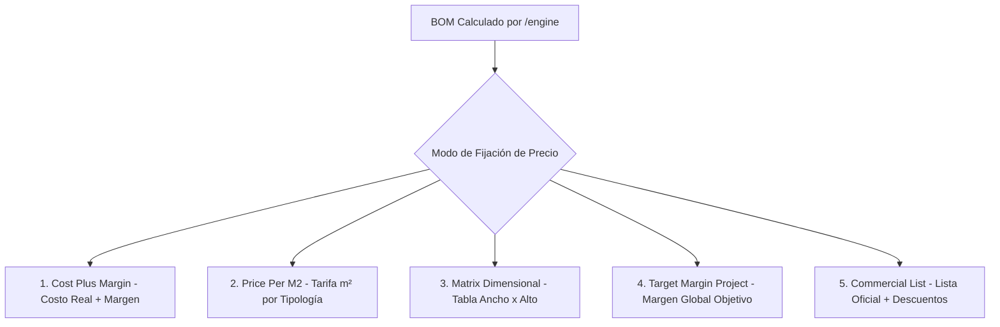

# PRD-05: MOTOR DE PRECIOS, LISTAS DE COSTO Y RENTABILIDAD (v1.1.0)
**Estado:** Bloqueado / Congelado  
**Fase:** 1 (Núcleo)  
**Bloquea a:** PRD-06, PRD-09, PRD-10, PRD-15

---

## 1. Visión y Filosofía Comercial

El motor de precios de Dekopen (`/engine/pricing.py` y `apps.pricing`) garantiza que ninguna carpintería venda bajo costo por errores de cálculo o desactualización de insumos.

### Principios Fundamentales
1. **Separación Estricta Costo vs. Precio:** Los costos de compra al proveedor son confidenciales y solo visibles para los roles `OWNER` y `WORKSHOP_MANAGER`. Los cotizadores (`ESTIMATOR`) operan con precios de venta y márgenes autorizados.
2. **Buffer de Tipo de Cambio (FX Buffer 5%):** Los insumos cotizados en USD (perfiles importados, herrajes alemanes/turcos) se convierten a CLP utilizando el tipo de cambio observado más un buffer de seguridad del $5\%$ para absorber fluctuaciones cambiarias durante la vigencia de la oferta.
3. **Inmutabilidad por Versión:** Al emitir una cotización, los costos y precios se congelan en `project_versions`. La actualización de una lista de costos de un proveedor jamás altera cotizaciones históricas vigentes.

---

## 2. Los 5 Modos Canónicos de Fijación de Precios (§6.2)

---

### Modo 1: Costo Real Más Margen (`COST_PLUS_MARGIN`) [Modo Recomendado por Defecto]
Es el cálculo más preciso. Desglosa cada centavo de material, merma, mano de obra e instalación:

$$\text{Costo Materiales Base} = \sum (\text{Metros Perfil} \times \text{Costo/m}) + \sum (\text{m}^2 \text{Vidrio} \times \text{Costo/m}^2) + \sum (\text{Kits Herrajes}) + \sum (\text{Accesorios})$$

$$\text{Costo Materiales con Merma} = \text{Costo Materiales Base} \times (1 + \text{waste\_factor\_pct})$$
*Donde $\text{waste\_factor\_pct} = 0.08$ ($8\%$ merma promedio de taller).*

$$\text{Costo Mano de Obra (Taller)} = \text{Área m}^2 \times \text{labor\_rate\_per\_m2}$$
$$\text{Costo Instalación (Faena)} = \text{Área m}^2 \times \text{installation\_rate\_per\_m2}$$

$$\text{Costo Directo Total} = \text{Costo Materiales con Merma} + \text{Costo Mano de Obra} + \text{Costo Instalación}$$

$$\text{Precio Venta Neto} = \frac{\text{Costo Directo Total}}{1 - \text{default\_margin\_pct}}$$
*Ejemplo:* Con costo directo de $\$100.000\text{ CLP}$ y margen del $35\%$ ($0.35$):
$$\text{Precio Neto} = \frac{100000}{1 - 0.35} = \frac{100000}{0.65} = \$153.846\text{ CLP}$$
$$\text{Margen Bruto Real Obtenido} = \frac{153846 - 100000}{153846} = 35.00\%$$

---

### Modo 2: Precio por Metro Cuadrado por Tipología (`PRICE_PER_M2_BY_TYPOLOGY`)
Utilizado para cotizaciones rápidas preliminares basadas en valores históricos de taller:
$$\text{Precio Base} = \text{Área m}^2 \times \text{Tarifa Base Tipología}$$
- Paño Fijo: $\$65.000\text{ CLP/m}^2$
- Practicable 1 Hoja: $\$110.000\text{ CLP/m}^2$
- Oscilobatiente: $\$135.000\text{ CLP/m}^2$
- Corredera 2 Hojas: $\$95.000\text{ CLP/m}^2$
- Puerta de Entrada: $\$180.000\text{ CLP/m}^2$

**Recargos por Opciones:**
- Foliado Color Madera / Antracita: $+25\%$ sobre el precio base de carpintería.
- Vidrio Especial Acústico / Laminado: $+(\text{Diferencial Costo Vidrio} \times 1.40)$.

---

### Modo 3: Matriz Dimensional Tabulada (`FIXED_PRICE_MATRIX_DIMENSIONAL`)
Matriz bidimensional de precios precalculados para medidas estándar (utilizada por fabricantes en serie):
- Filas: Alturas de $600\text{ mm}$ a $2400\text{ mm}$ (pasos de $200\text{ mm}$).
- Columnas: Anchos de $600\text{ mm}$ a $2400\text{ mm}$ (pasos de $200\text{ mm}$).
- Interpolación bilineal automática para medidas intermedias no tabuladas.

---

### Modo 4: Margen Global Objetivo de Proyecto (`TARGET_GROSS_MARGIN_PROJECT`)
Permite al Propietario fijar un margen consolidado para una licitación o constructora completa (e.g. $42\%$ neto). El sistema distribuye automáticamente los precios de cada posición ponderando su complejidad y consumo de insumos.

---

### Modo 5: Lista Comercial con Escala de Descuentos (`COMMERCIAL_LIST_WITH_DISCOUNTS`)
Lista de precios de catálogo público con matriz de descuentos por segmento de cliente:
- Particular / Consumidor Final: $0\%$ descuento.
- Arquitecto / Diseñador Frecuente: $8\%$ a $12\%$ descuento.
- Empresa Constructora (Volumen $> 50\text{ ventanas}$): $18\%$ a $25\%$ descuento.

---

## 3. Listas de Costo de Proveedores y Vigencias

1. **Campos Temporales:** Las listas de costo poseen `valid_from` (fecha inicio obligatoria) y `valid_to` (fecha fin opcional).
2. **Resolución Automática:** Al crear o duplicar una posición, el motor busca la lista de costo activa cuya vigencia cubra la fecha actual del sistema.
3. **Importación Rápida desde Excel:** Soporte para importar archivos `.xlsx` de proveedores (Aluplast, Rehau, VEKA, Roto, Winkhaus, Vorne) mapeando columnas SKU, Descripción, Unidad y Precio Unitario.

---

## 4. Gobernanza de Descuentos y Permisos Comerciales

| Rango de Descuento | Rol Requerido para Aplicar | Comportamiento del Sistema |
|---|---|---|
| **$0\% \le \text{Desc} \le 10\%$** | `ESTIMATOR`, `OWNER` | Aplicación instantánea en la cotización. |
| **$10\% < \text{Desc} \le 20\%$** | `OWNER` (o `ESTIMATOR` con aprobación) | La cotización queda en estado `PENDING_OWNER_APPROVAL`. El Propietario recibe alerta en dashboard. |
| **$\text{Desc} > 20\%$** | Exclusivo `OWNER` | Requiere confirmación con advertencia de margen crítico. |
| **Margen Negativo ($\text{Precio} < \text{Costo}$)** | **PROHIBIDO** | El sistema bloquea el guardado con alerta de inspector comercial: *"Pérdida detectada en posición"*. |
