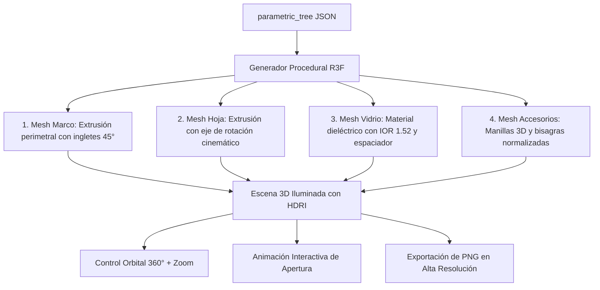

# PRD-12: VISOR 3D ESQUEMÁTICO Y ENLACE INTERACTIVO PARA CLIENTES (v1.1.0)
**Estado:** Bloqueado / Congelado  
**Fase:** 3 (Experiencia Visual)  
**Bloquea a:** Ninguno

---

## 1. Misión y Propósito Comercial

El módulo 3D (implementado con **React Three Fiber / Three.js**) permite a los talleres generar una visualización tridimensional interactiva y fotorrealista de las aberturas cotizadas a partir del `parametric_tree` 2D, elevando el valor percibido por el cliente final y acelerando la tasa de cierre de ventas.

---

## 2. Generación Procedural de Geometrías 3D

El visor 3D extruye y ensambla proceduralmente cada componente a partir de los datos geométricos calculados en `/engine`:

### 2.1. Cinemática y Animación de Aperturas
Al hacer clic sobre la manilla o presionar el botón *"Simular Apertura"*:
1. **Practicable (Giro Lateral):** La manilla rota $90^\circ$ hacia abajo y la hoja pivota sobre el eje vertical de las bisagras de $0^\circ$ a $90^\circ$.
2. **Oscilobatiente (Abatimiento):** La manilla rota $180^\circ$ hacia arriba y la hoja bascula hacia el interior sobre el eje horizontal inferior de $0^\circ$ a $15^\circ$.
3. **Corredera (Traslación):** La hoja móvil se desliza horizontalmente sobre su carril respectivo hasta el tope lateral.

---

## 3. Shader de Materiales y Renderizado de Colores

El motor de materiales implementa shaders PBR (Physically Based Rendering) estandarizados:
- **PVC Blanco:** `roughness: 0.25`, `metalness: 0.0`, `color: #F8FAFC`.
- **Foliado Roble Dorado (Golden Oak):** Textura procedural con relieve sutil de veta de madera (`normalMap`).
- **Foliado Gris Antracita (RAL 7016):** `roughness: 0.40`, `color: #374151`.
- **Vidrio Termopanel (DVH):** `transmission: 0.92`, `ior: 1.52`, `roughness: 0.05`, `thickness: 24.0`, intercalario interior de aluminio con sellado de butilo negro.

---

## 4. Enlace Público Compartible para Clientes (`/view/{share_token}`)

Cada cotización aprobada puede generar un enlace público protegido:
- **URL:** `https://app.dekopen.com/view/dko_live_7a9f8e21`
- **Capacidades del Cliente:**
  - Inspección 3D orbital completa desde cualquier smartphone o computadora sin instalar software.
  - Alternancia interactiva de colores de perfil (Blanco vs. Madera vs. Antracita) para ver el impacto visual.
  - Simulación de apertura de todas las hojas móviles.
  - Botón de Aceptación Digital: *"Aprobar Cotización Formalmente"* con firma táctil en pantalla y confirmación por email.
- **Seguridad:** Vista 100% en modo lectura. Los costos brutos, despieces de corte, marcas de perfiles y márgenes están totalmente ocultos y purgados del bundle de datos enviado al navegador.
