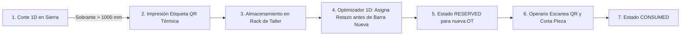

# PRD-16: GESTIÓN E INTEGRACIÓN DE INVENTARIO DE RETAZOS (OFFCUTS) (v1.1.0)
**Estado:** Bloqueado / Congelado  
**Fase:** 4 (Optimización de Taller)  
**Bloquea a:** Ninguno

---

## 1. Misión y Justificación del Módulo

El módulo de Inventario de Retazos (`offcut_inventory`) permite a las carpinterías recuperar entre el $6\%$ y el $12\%$ del costo total de perfilería mediante el etiquetado por código QR y la reutilización automatizada de sobrantes de barra en futuras órdenes de trabajo.

---

## 2. Esquema DDL de Retazos (`offcut_inventory`)

```sql
CREATE TYPE offcut_status AS ENUM ('AVAILABLE', 'RESERVED', 'CONSUMED', 'DISCARDED');

CREATE TABLE offcut_inventory (
    id UUID PRIMARY KEY DEFAULT uuid_generate_v4(),
    org_id UUID NOT NULL REFERENCES tenancy_organizations(id) ON DELETE CASCADE,
    profile_article_id UUID NOT NULL REFERENCES profile_articles(id) ON DELETE RESTRICT,
    color VARCHAR(50) NOT NULL,
    length_mm NUMERIC(10, 2) NOT NULL CHECK (length_mm >= 500.00),
    rack_location VARCHAR(50), -- e.g. "Rack B, Nivel 2"
    source_order_id UUID REFERENCES orders(id) ON DELETE SET NULL,
    reserved_order_id UUID REFERENCES orders(id) ON DELETE SET NULL,
    status offcut_status NOT NULL DEFAULT 'AVAILABLE',
    qr_code VARCHAR(100) NOT NULL,
    created_at TIMESTAMPTZ NOT NULL DEFAULT NOW(),
    consumed_at TIMESTAMPTZ,
    CONSTRAINT uk_org_offcut_qr UNIQUE (org_id, qr_code)
);

CREATE INDEX idx_offcut_lookup ON offcut_inventory (org_id, profile_article_id, color, status, length_mm);
```

---

## 3. Ciclo de Vida del Retazo y Etiquetado QR



---

## 4. Integración en el Algoritmo de Corte 1D

1. Al ejecutar la optimización de corte de una orden de producción:
   - El optimizador consulta los retazos `AVAILABLE` para el SKU y color requeridos.
   - Si una pieza requerida cabe en un retazo existente (considerando $15\text{ mm}$ de despunte y $4\text{ mm}$ de kerf), se prioriza el retazo antes de abrir una barra comercial nueva de $6.00\text{ m}$.
   - Se actualiza el estado del retazo a `RESERVED` vinculado al `order_id` de la OT.
