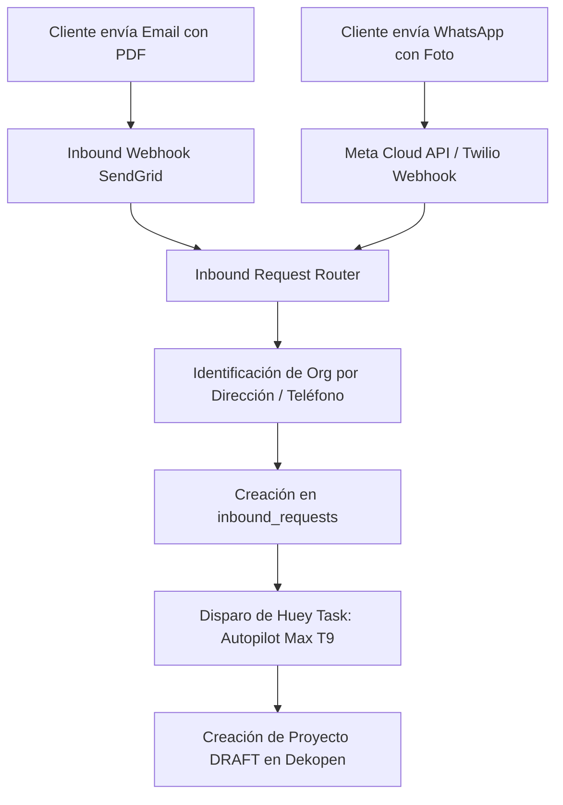

# PRD-17: BANDEJA DE ENTRADA OMNICANAL (EMAIL Y WHATSAPP) (v1.1.0)
**Estado:** Bloqueado / Congelado  
**Fase:** 4 (Captura Omnicanal)  
**Bloquea a:** Ninguno

---

## 1. Misión del Módulo

La Bandeja de Entrada Omnicanal (`apps.inbox`) centraliza la recepción de solicitudes de presupuesto provenientes de correos electrónicos y mensajes de WhatsApp con archivos adjuntos, canalizándolos hacia el pipeline de Autopilot Max (PRD-15).

---

## 2. Arquitectura de Ingestión



---

## 3. Esquema DDL de Ingestión (`inbound_requests`)

```sql
CREATE TYPE inbound_source AS ENUM ('EMAIL', 'WHATSAPP', 'WEB_FORM');
CREATE TYPE inbound_status AS ENUM ('RECEIVED', 'PROCESSING', 'STAGED', 'FAILED', 'ARCHIVED');

CREATE TABLE inbound_requests (
    id UUID PRIMARY KEY DEFAULT uuid_generate_v4(),
    org_id UUID NOT NULL REFERENCES tenancy_organizations(id) ON DELETE CASCADE,
    source inbound_source NOT NULL,
    sender_identifier VARCHAR(255) NOT NULL, -- Email o número de teléfono
    sender_name VARCHAR(255),
    subject TEXT,
    raw_body TEXT,
    attachment_storage_paths JSONB NOT NULL DEFAULT '[]'::JSONB,
    status inbound_status NOT NULL DEFAULT 'RECEIVED',
    created_project_id UUID REFERENCES projects(id) ON DELETE SET NULL,
    error_message TEXT,
    created_at TIMESTAMPTZ NOT NULL DEFAULT NOW()
);
```

---

## 4. Gobernanza y Seguridad de Adjuntos

1. **Escaneo de Seguridad:** Todos los archivos adjuntos se validan mediante análisis de MIME-type estricto (solo `.pdf`, `.png`, `.jpg`, `.jpeg`, `.xlsx`) y escaneo antivirus antes de almacenarse en Supabase Storage.
2. **Aislamiento por Tenant:** Los archivos de la bandeja se enrutan a la carpeta `org_{org_id}/inbox/{request_uuid}/`.
