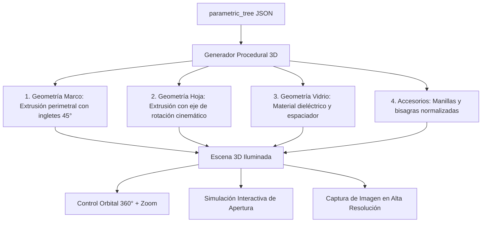

# PRD-12: LIVE PORTAL CLIENTE, EXPORTADOR CAD 2D .DXF Y VISOR 3D TÉCNICO (v1.3 MASTER)
**Estado:** Bloqueado / Congelado
**Versión:** 1.3 (SHOT-19: Live View • CAD 2D .DXF • 3D Técnico y Cinemática • AR diferida post-V1)
**Hash de Integridad Normativa:** `[HASH-RECALCULAR-AL-EMITIR]`
**Fase:** 3 (Salidas Digitales y Experiencia Visual)
**Bloquea a:** PRD-13

---

## 1. Misión del Módulo de Salidas Digitales (SHOT-19)

Entregar a los talleres tres herramientas comerciales y técnicas de alto impacto que modernizan la interacción con constructoras y clientes finales:
1. **Enlace Web en Vivo para Clientes (`/view/[token]`):** Portal interactivo para que el cliente final o la constructora revise la cotización desde cualquier dispositivo sin instalar software.
2. **Exportador de Planos Técnicos 2D (.DXF):** Descarga instantánea de secciones de perfiles y elevaciones en formato compatible con AutoCAD para arquitectos y proyectistas.
3. **Visor 3D Técnico y Cinemática de Apertura:** Visualización volumétrica fotorrealista interactiva a partir del `parametric_tree` 2D con simulación dinámica de apertura para maximizar la tasa de cierre de ventas.
*(Nota de Alcance: La Realidad Aumentada [AR] en terreno permanece como Future Capability posterior post-V1).*

---

## 2. Especificación del Enlace Web en Vivo (`/view/[token]`)

Ruta pública de solo lectura protegida con token criptográfico UUID:
- **Seguridad Inviolable:** El bundle de JavaScript y las respuestas de API **JAMÁS contienen costos de compra, fórmulas de margen ni despiece interno del taller**. Solo exponen dimensiones exteriores, tipo de apertura, color, vidrio y precio de venta final.
- **Interactividad Comercial:** El cliente puede aprobar el presupuesto directamente desde su teléfono o solicitar ajustes.
- **Acciones Disponibles:**
  - `Descargar Cotización Oficial (PDF DOC-01)`
  - `Aceptar Presupuesto y Solicitar Anticipo`
  - `Ver Plano Técnico Vectorial (SVG)`
  - `Inspeccionar en 3D Interactivo con Cinemática`

---

## 3. Exportador de Planos CAD 2D (.DXF)

Utiliza la librería en Python `ezdxf` en el backend para generar planos vectoriales limpios con capas normalizadas:
- **Capa 0 (Estructura):** Geometría exterior del vano y marco con cotas milimétricas.
- **Capa 1 (Hojas y Perfiles):** Líneas de perfilería de PVC y refuerzos de acero.
- **Capa 2 (Vidrios y Junquillos):** Polígonos de vidrio con espesor y etiquetas de composición (ej: `5-12-5`).
- **Capa 3 (Simbología de Apertura):** Líneas discontinuas normalizadas que indican el sentido de apertura (interior/exterior/corredera).

---

## 4. Visualización Procedural 3D y Cinemática de Apertura

A partir del `parametric_tree` calculado deterministamente en `/engine`, el módulo visual genera y ensambla proceduralmente los componentes de la abertura:

### 4.1. Cinemática y Simulación Interactiva de Aperturas
Al presionar sobre la manilla o accionar el control de *"Simular Apertura"*:
1. **Practicable (Giro Lateral):** La manilla rota $90^\circ$ hacia abajo y la hoja pivota sobre el eje vertical de las bisagras de $0^\circ$ a $90^\circ$.
2. **Oscilobatiente (Abatimiento Basculante):** La manilla rota $180^\circ$ hacia arriba y la hoja bascula hacia el interior sobre el eje horizontal inferior de $0^\circ$ a $15^\circ$.
3. **Corredera (Traslación):** La hoja móvil se desplaza horizontalmente sobre su carril respectivo hasta el tope lateral del marco.

### 4.2. Materiales y Representación Fiel
Representación fiel de los materiales industriales sin atadura dogmática a un motor de renderizado exclusivo:
- **PVC Blanco:** Acabado liso satinado técnico (`color: #F8FAFC`).
- **Foliados Madera / Roble Dorado / Nogal:** Texturas con relieve sutil de veta de madera.
- **Foliados Gris Antracita (RAL 7016):** Acabado mate arquitectónico (`color: #374151`).
- **Vidrio Termopanel (DVH):** Superficie translúcida reflectiva con índice de refracción dieléctrico (`ior: 1.52`) e intercalario perimetral con sellado negro.
