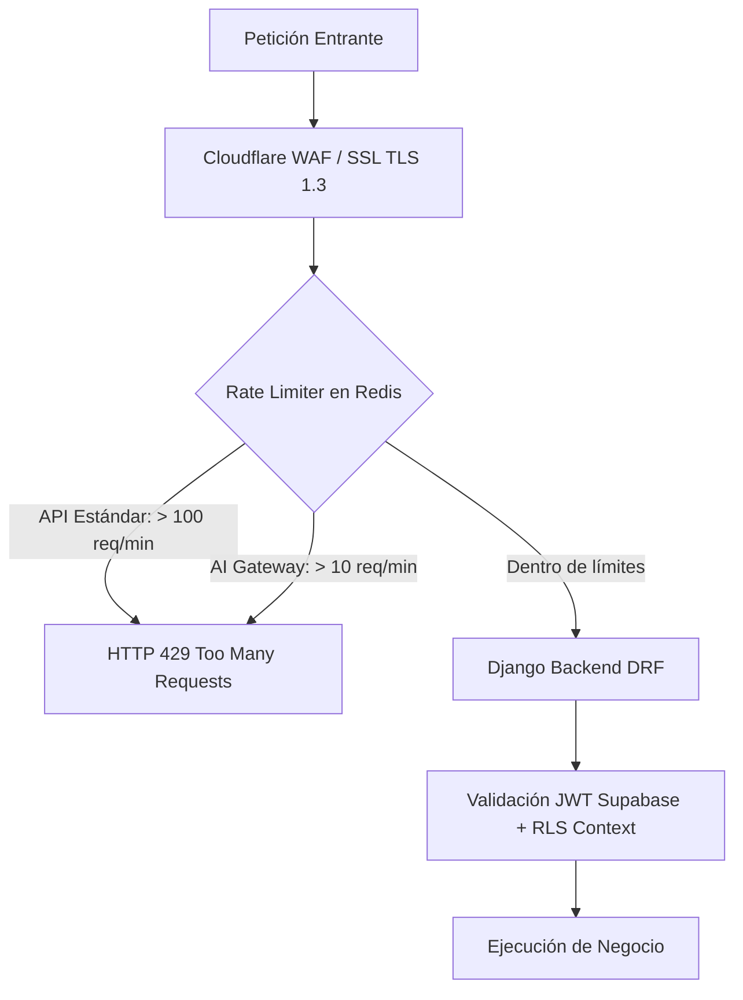

# PRD-19: REQUERIMIENTOS NO FUNCIONALES (NFR), SEGURIDAD, OBSERVABILIDAD Y RECUPERACIÓN ANTE DESASTRES (v1.2 MASTER)
**Estado:** Bloqueado / Congelado  
**Versión:** 1.2 (Master Sealed Standard)  
**Fase:** 0 (Fundacional)  
**Bloquea a:** Todo el despliegue a producción

---

## 1. Matriz de Requerimientos No Funcionales (NFR)

| Dimensión | Métrica Objetivo | Umbral Crítico de Alarma | Estrategia de Mitigación / Infraestructura |
|---|---|---|---|
| **Disponibilidad (SLA)** | $\ge 99.9\%$ uptime mensual | $< 99.5\%$ | Railway con workers auto-restart + Supabase Pro PostgreSQL 16. |
| **Latencia del Engine** | $< 50\text{ ms}$ por posición | $> 150\text{ ms}$ | Pureza del paquete `/engine` sin llamadas I/O ni red en caliente. |
| **Fluidez del Canvas 2D** | $\ge 60\text{ FPS}$ en renderizado SVG | $< 30\text{ FPS}$ | React memoization de nodos, renderizado vectorial SVG nativo. |
| **Generación de PDFs** | $< 2.5\text{ s}$ para cotización de 10 vanos | $> 5.0\text{ s}$ | WeasyPrint pre-compilado en workers asíncronos Huey. |
| **Pérdida de Datos (RPO)** | $\le 1\text{ hora}$ | $> 2\text{ horas}$ | Dumps cifrados continuos a Supabase Storage + PITR de Supabase. |
| **Tiempo de Recuperación (RTO)** | $\le 2\text{ horas}$ | $> 4\text{ horas}$ | Scripts de aprovisionamiento automatizado y simulacro ensayado. |

---

## 2. Estrategia de Respaldos y Protocolo de Restauración Ensayada (GNG-10-DISASTER-RECOVERY)

> [!IMPORTANT]
> **Principio de Respaldo Real:** Un respaldo que nunca ha sido restaurado en un simulacro real equivale a no tener respaldo.

1. **Respaldos Diarios Cifrados:**
   - Cada noche a las 03:00 UTC, una tarea cron ejecuta `pg_dump` con compresión máxima.
   - El archivo se cifra simétricamente con `AES-256` utilizando la clave maestra `BACKUP_ENCRYPTION_KEY`.
   - Se almacena de forma segura en el bucket `dekopen-backups` de Supabase Storage.
2. **Simulacro de Restauración Obligatorio (`scripts/restore_drill.sh` en SHOT-11):**
   - En SHOT-11, el gate exige ejecutar y documentar un simulacro de recuperación completo en una instancia PostgreSQL limpia a partir del último dump cifrado, verificando la integridad de datos y relaciones.

---

## 3. Seguridad, Rate Limiting y Protección de API

### 3.1. Políticas de Seguridad de Aplicación
- **Cero Credenciales en Código:** Variables de entorno administradas exclusivamente vía Railway Environment Secrets.
- **Sanitización XSS y CSP:** Content Security Policy estricto en cabeceras HTTP emitidas por Django.
- **URLs Firmadas con Expiración:** Todo acceso a planos, PDFs y comprobantes en Supabase Storage requiere firma criptográfica temporal ($3600\text{ s}$).

---

## 4. Pila de Observabilidad y Telemetría Estructurada

1. **Grabación Visual de Sesiones y Bugs:** **Jam.dev** integrado en la SPA. Permite al usuario reportar un problema en 1 clic capturando automáticamente el estado de la consola, logs de red y grabación de pantalla.
2. **Métricas de Producto y Adopción:** **PostHog Cloud** para análisis de embudos de conversión (Onboarding $\rightarrow$ Primera cotización $\rightarrow$ Aprobación de OT), retención de usuarios y feature flags.
3. **Logs Estructurados en Producción (`structlog`):** Formato JSON unificado en backend con inyección obligatoria de:
   - `user_id`: UUID del usuario autenticado.
   - `org_id`: UUID del taller / organización.
   - `project_id` & `version_id`: Contexto de la cotización.
   - `engine_version`: Hash o versión del motor técnico.
   - `model_route`: Modelo de IA utilizado (si aplica).
   - `latency_ms`: Tiempo de ejecución en milisegundos.
   - `timestamp`: Marca de tiempo ISO-8601 UTC.
