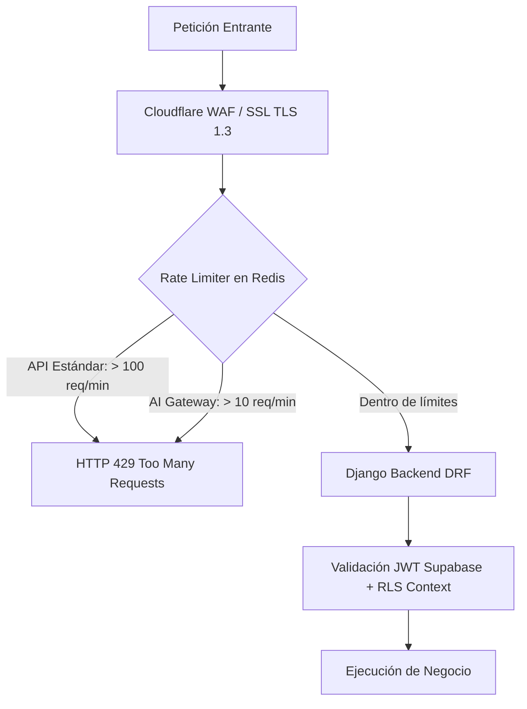

# PRD-19: REQUERIMIENTOS NO FUNCIONALES (NFR), SEGURIDAD, OBSERVABILIDAD Y RECUPERACIÓN ANTE DESASTRES (v1.1.0)
**Estado:** Bloqueado / Congelado  
**Fase:** 0 (Fundacional)  
**Bloquea a:** Todo el despliegue a producción

---

## 1. Matriz de Requerimientos No Funcionales (NFR)

| Dimensión | Métrica Objetivo | Umbral Crítico de Alarma | Estrategia de Mitigación |
|---|---|---|---|
| **Disponibilidad (SLA)** | $\ge 99.9\%$ uptime mensual | $< 99.5\%$ | Railway multi-replica + Supabase Pro con alta disponibilidad gestionada. |
| **Latencia del Engine** | $< 50\text{ ms}$ por cálculo de posición | $> 150\text{ ms}$ | Pureza del paquete `/engine` sin llamadas I/O en caliente. |
| **Fluidez del Canvas 2D** | $\ge 60\text{ FPS}$ en renderizado SVG | $< 30\text{ FPS}$ | React memoization de nodos, renderizado vectorial SVG nativo sin capas pesadas. |
| **Generación de PDFs** | $< 2.5\text{ s}$ para cotización de 10 vanos | $> 5.0\text{ s}$ | WeasyPrint pre-compilado en workers dedicados de Huey. |
| **Pérdida de Datos (RPO)** | $\le 5\text{ minutos}$ | $> 15\text{ minutos}$ | Supabase Point-in-Time Recovery (PITR) continuo. |
| **Tiempo de Recuperación (RTO)** | $\le 60\text{ minutos}$ | $> 120\text{ minutos}$ | Scripts automatizados de aprovisionamiento de infraestructura. |

---

## 2. Estrategia de Respaldos y Protocolo de Restauración Ensayada (Gate 7)

> [!IMPORTANT]
> Un respaldo que nunca ha sido restaurado en un simulacro real equivale a no tener respaldo.

1. **Respaldos Continuos (PITR):** Supabase Pro mantiene bitácora de transacciones WAL (Write-Ahead Logging) con capacidad de restauración a cualquier segundo de los últimos 7 días.
2. **Dump Diario Cifrado:**
   - Cada noche a las 03:00 UTC, una tarea cron ejecuta `pg_dump` con compresión máxima.
   - El archivo se cifra simétricamente con `AES-256` utilizando una clave maestra en variables de entorno.
   - Se almacena de forma segura en el bucket `dekopen-backups` de Supabase Storage.
3. **Simulacro de Restauración Obligatorio (Gate 7):**
   - Antes de pasar a producción comercial, se debe ejecutar y documentar un simulacro de recuperación completo en un ambiente de staging limpio a partir del último dump cifrado.

---

## 3. Seguridad, Rate Limiting y Protección de API

### 3.1. Políticas de Seguridad de Aplicación
- **Cero Credenciales en Código:** Variables de entorno administradas exclusivamente vía Railway Environment Secrets.
- **Sanitización XSS y CSP:** Content Security Policy estricto en cabeceras HTTP emitidas por Django y Vercel.
- **URLs Firmadas con Expiración:** Todo acceso a planos, PDFs y comprobantes en Supabase Storage requiere firma criptográfica temporal ($3600\text{ s}$).

---

## 4. Pila de Observabilidad y Telemetría

1. **Grabación Visual de Sesiones y Bugs:** **Jam.dev** integrado en la SPA. Permite al usuario reportar un problema en 1 clic capturando automáticamente el estado de la consola, logs de red y grabación de pantalla sin fricción.
2. **Métricas de Producto y Adopción:** **PostHog Cloud** para análisis de embudos de conversión (Onboarding $\rightarrow$ Primera cotización $\rightarrow$ Aprobación de OT), retención de usuarios y feature flags.
3. **Logs Estructurados en Producción:** Formato JSON unificado en backend (`structlog` en Python) con inyección automática de `org_id`, `user_id` y `trace_id` para trazabilidad inmediata en los paneles de logs de Railway.
