# Contrato de simbología de apertura

DEKOPEN declara **Vista interior** por defecto. La vista exterior refleja el
dibujo completo una sola vez y cambia continuo ↔ discontinuo en las aperturas
de giro. El selector cambia la lectura, nunca el producto guardado.

La constitución §3.6 prevalece sobre el tablero histórico invertido: bisagras en
la base del triángulo DIN, vértice hacia la manilla. Abatimiento desde las dos
esquinas inferiores al centro superior. Proyectante hacia afuera: discontinuo
en interior, continuo en exterior. Puertas: triángulo en elevación, sin arco de
giro. Fijo: silencio, sin símbolo. La altura de manilla solo se dibuja desde
geometría del motor o un datum explícito; la ausencia no se convierte en 1 050 mm.

## Dirección y carriles

`SlidingPanel.travel` declara `LEFT` o `RIGHT` en una móvil; `null` solo en un
paño fijo. La ausencia histórica se lee con la convención anterior y se rotula
**Dirección inferida**. La lectura y serialización históricas omiten el campo,
conservando el hash anterior. Editar una receta/apertura o el inspector declara
el recorrido y permite deshacer. Guardar y recargar conserva esa intención.

La hoja de una jamba no puede viajar hacia ella; dos móviles adyacentes no
comparten carril. Tres hojas tienen dirección explícita en la central. O/X/X/O
admite las dos centrales hacia afuera o hacia el encuentro, con carriles
distintos. Una hoja fija sin carril no recibe un índice inventado.

`track = 0` representa el carril exterior; los índices crecen hacia el interior.
El catálogo vigente no declara otro orden físico. Es una **convención de dibujo**,
sin autoridad del fabricante y sin efecto en corte/capacidad. Cada planta
declara EXTERIOR/INTERIOR y numera desde 1 para lectura humana. Sin layout
explícito no se dibuja una planta. Sus bahías/anchos vienen del motor; nunca se
reparte arbitrariamente el ancho entre ellas.

## Primitivas, cotas y formas

La gramática normalizada Decimal vive en `engine/src/dekopen_engine/symbols.py`.
`scripts/generate_opening_symbols.py` exporta la misma tabla y selección por
movimiento a React. El lint falla si la copia diverge. Los 56 fixtures compartidos
se verifican por Python, el renderer PDF y TS. Las coordenadas de líneas,
discontinuidad, flechas y manillas son las mismas en mm antes del escalado.

Trazo monolínea de 1,5 px, puntas cuadradas, inglete, tinta secundaria de grafito,
sin escalar el grosor en SVG. Discontinuo `6 4`. Escala afín dentro de la hoja;
no calcula medidas de fabricación. Los documentos adaptan el grosor al papel.
Los números son Plex Mono tabular; cotas técnicas en mm enteros con redondeo
HALF_UP. El dato y las entradas exactas no se redondean.

Las cadenas exteriores muestran total; las interiores miden a ejes desde
offsets locales exactos del árbol. Cada división anidada recibe un nivel de
gutter. Las cotas verticales y de manilla van fuera del conjunto, no dentro de
la hoja vecina. Los textos se contrarreflejan para seguir siendo legibles.
Las etiquetas cortas alternan niveles; cada módulo apilado reserva su propia
cadena horizontal. El PDF añade total del conjunto, testigos y margen de texto
en ambos lados, también cuando una etiqueta mide más que el segmento.

Trapecio, triángulo, arco rebajado y medio punto usan el contorno real y su
inset para marco/vidrio, con papel claro. Un arco válido no certifica curvado:
el gate de fabricación conserva las autoridades pendientes. Los movimientos
avanzados reservados en este muestrario no habilitan D08 ni una fabricación.

## Muestrario ilustrado

Estas ilustraciones son casos sintéticos de gramática, no planos de fabricación
de un proveedor. La tabla DEV `/dev/ui` consume los mismos casos.

| Caso y vista | Ilustración |
|---|---|
| Fijo · vista interior |  |
| Fijo · vista exterior |  |
| Abatible izquierda · vista interior | 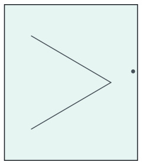 |
| Abatible izquierda · vista exterior | 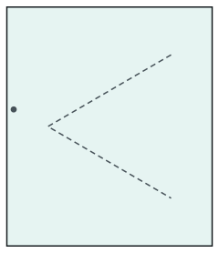 |
| Abatible derecha · vista interior | 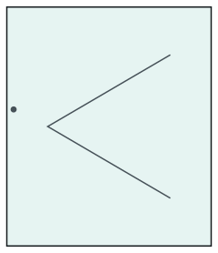 |
| Abatible derecha · vista exterior | 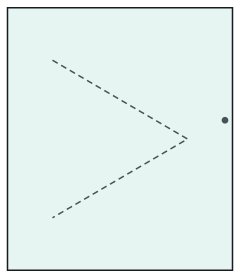 |
| Oscilobatiente izquierda · vista interior |  |
| Oscilobatiente izquierda · vista exterior | 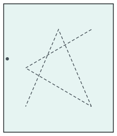 |
| Oscilobatiente derecha · vista interior |  |
| Oscilobatiente derecha · vista exterior | 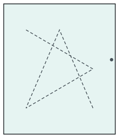 |
| Proyectante · vista interior | 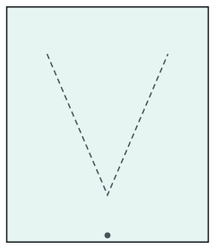 |
| Proyectante · vista exterior | 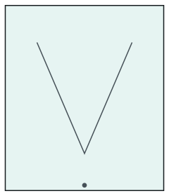 |
| Solo abatimiento · vista interior | 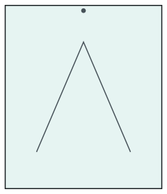 |
| Solo abatimiento · vista exterior | 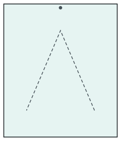 |
| Puerta izquierda · vista interior |  |
| Puerta izquierda · vista exterior |  |
| Puerta derecha · vista interior |  |
| Puerta derecha · vista exterior |  |
| Corredera 2 hojas · vista interior | 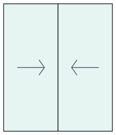 |
| Corredera 2 hojas · vista exterior | 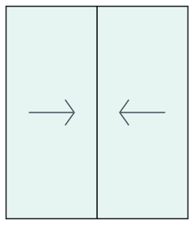 |
| Corredera 3 hojas · vista interior | 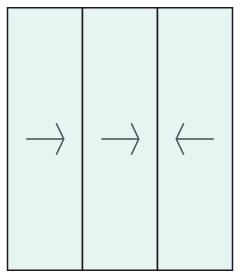 |
| Corredera 3 hojas · vista exterior | 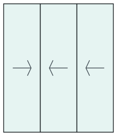 |
| Corredera 4 hojas · vista interior |  |
| Corredera 4 hojas · vista exterior |  |
| O X X O · encuentro · vista interior |  |
| O X X O · encuentro · vista exterior | 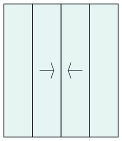 |
| O X X O · separan · vista interior | 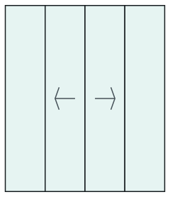 |
| O X X O · separan · vista exterior |  |
| Puerta doble · vista interior | 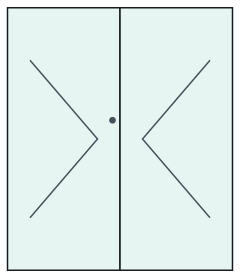 |
| Puerta doble · vista exterior | 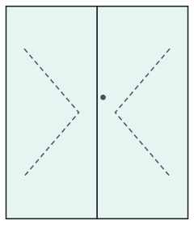 |
| Francesa · vista interior |  |
| Francesa · vista exterior |  |
| Abatible hacia afuera · izquierda · vista interior |  |
| Abatible hacia afuera · izquierda · vista exterior |  |
| Abatible hacia afuera · derecha · vista interior |  |
| Abatible hacia afuera · derecha · vista exterior |  |
| Oscilobatiente hacia afuera · izquierda · vista interior | 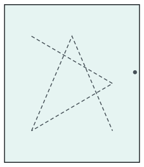 |
| Oscilobatiente hacia afuera · izquierda · vista exterior |  |
| Oscilobatiente hacia afuera · derecha · vista interior | 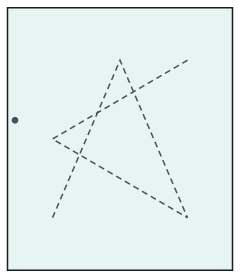 |
| Oscilobatiente hacia afuera · derecha · vista exterior |  |
| Fijo en hoja · vista interior |  |
| Fijo en hoja · vista exterior |  |
| Diagrama reservado · Banderola hacia afuera · vista interior | 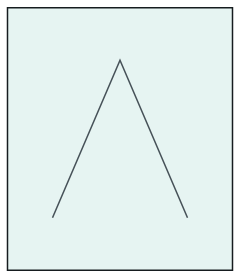 |
| Diagrama reservado · Banderola hacia afuera · vista exterior | 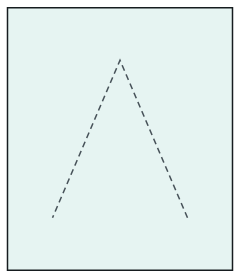 |
| Diagrama reservado · Elevable · vista interior | 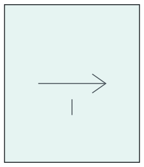 |
| Diagrama reservado · Elevable · vista exterior | 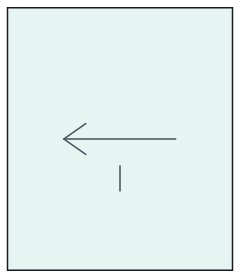 |
| Diagrama reservado · Paralela · vista interior | 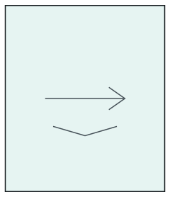 |
| Diagrama reservado · Paralela · vista exterior | 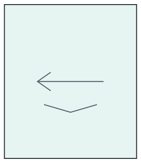 |
| Diagrama reservado · Plegable · vista interior | 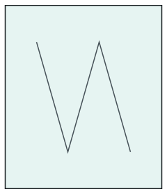 |
| Diagrama reservado · Plegable · vista exterior | 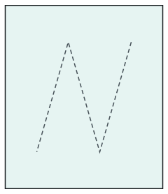 |
| Diagrama reservado · Pivotante vertical · vista interior |  |
| Diagrama reservado · Pivotante vertical · vista exterior | 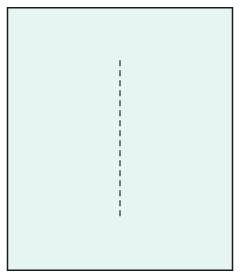 |
| Diagrama reservado · Pivotante horizontal · vista interior | 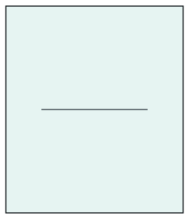 |
| Diagrama reservado · Pivotante horizontal · vista exterior | 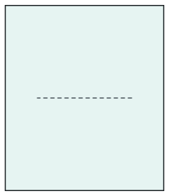 |
| Diagrama reservado · Guillotina · vista interior | 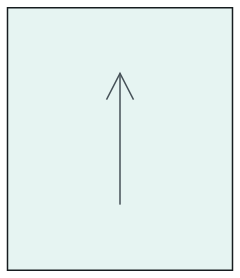 |
| Diagrama reservado · Guillotina · vista exterior |  |
